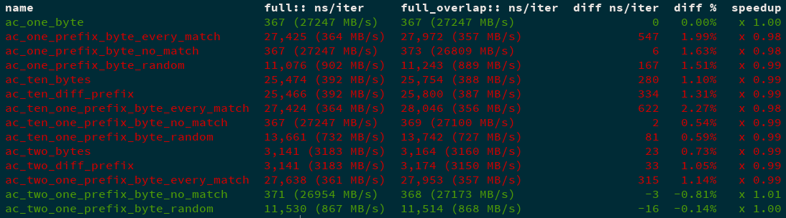

cargo benchcmp
==============
A small utility for comparing micro-benchmarks produced by `cargo bench`. The
utility takes as input two sets of micro-benchmarks (one "old" and the other
"new") and shows as output a comparison between each benchmark.

[](https://travis-ci.org/BurntSushi/cargo-benchcmp)
[](https://ci.appveyor.com/project/BurntSushi/cargo-benchcmp)
[](https://crates.io/crates/cargo-benchcmp)

Dual-licensed under MIT or the [UNLICENSE](http://unlicense.org).

### Installation

`cargo benchcmp` can be installed with `cargo install`:

```
$ cargo install cargo-benchcmp
```

The resulting binary should then be in `$HOME/.cargo/bin`.

### Criterion support

This tool only supports the standard benchmark output emitted by `cargo bench`.
For Criterion support, a different tool was developed called
[critcmp](https://github.com/BurntSushi/critcmp).

### Example output



### Usage

First, run your benchmarks and save them to a file:

```
$ cargo bench > control
```

Next, apply the changes you'd like to test out, and then run the benchmarks and
save them to a file again.

```
$ cargo bench > variable
```

Finally, use `cargo benchcmp` to compare the benchmark results!

```
$ cargo benchcmp control variable
 name                                bench_output_3.txt ns/iter  bench_output_2.txt ns/iter  diff ns/iter   diff %  speedup
 ac_one_byte                         354 (28248 MB/s)            349 (28653 MB/s)                      -5   -1.41%   x 1.01
 ac_one_prefix_byte_every_match      150,581 (66 MB/s)           112,957 (88 MB/s)                -37,624  -24.99%   x 1.33
 ac_one_prefix_byte_no_match         354 (28248 MB/s)            350 (28571 MB/s)                      -4   -1.13%   x 1.01
 ac_one_prefix_byte_random           20,273 (493 MB/s)           16,096 (621 MB/s)                 -4,177  -20.60%   x 1.26
 ac_ten_bytes                        108,092 (92 MB/s)           58,588 (170 MB/s)                -49,504  -45.80%   x 1.84
 ac_ten_diff_prefix                  108,082 (92 MB/s)           58,601 (170 MB/s)                -49,481  -45.78%   x 1.84
...
```

If you want to compare the same benchmark run in multiple ways, reuse the names
in different modules. Then your benchmark output will look like:

```
module1::ac_two_one_prefix_byte_random   ...
module2::ac_two_one_prefix_byte_random   ...
```

You can then instruct benchcmp to compare the two modules by providing the two
prefixes, followed by the file containing the output:

```
$ cargo benchcmp module1:: module2:: benchmark-output
 name                                dense_boxed:: ns/iter  dense:: ns/iter    diff ns/iter   diff %  speedup
 ac_one_byte                         354 (28248 MB/s)       349 (28653 MB/s)             -5   -1.41%   x 1.01
 ac_one_prefix_byte_every_match      150,581 (66 MB/s)      112,957 (88 MB/s)       -37,624  -24.99%   x 1.33
 ac_one_prefix_byte_no_match         354 (28248 MB/s)       350 (28571 MB/s)             -4   -1.13%   x 1.01
 ac_one_prefix_byte_random           20,273 (493 MB/s)      16,096 (621 MB/s)        -4,177  -20.60%   x 1.26
 ac_ten_bytes                        108,092 (92 MB/s)      58,588 (170 MB/s)       -49,504  -45.80%   x 1.84
 ac_ten_diff_prefix                  108,082 (92 MB/s)      58,601 (170 MB/s)       -49,481  -45.78%   x 1.84
 ac_ten_one_prefix_byte_every_match  150,561 (66 MB/s)      112,920 (88 MB/s)       -37,641  -25.00%   x 1.33
 ac_ten_one_prefix_byte_no_match     354 (28248 MB/s)       350 (28571 MB/s)             -4   -1.13%   x 1.01
 ac_ten_one_prefix_byte_random       23,684 (422 MB/s)      19,181 (521 MB/s)        -4,503  -19.01%   x 1.23
 ac_two_bytes                        3,138 (3186 MB/s)      3,125 (3200 MB/s)           -13   -0.41%   x 1.00
 ac_two_diff_prefix                  3,138 (3186 MB/s)      3,124 (3201 MB/s)           -14   -0.45%   x 1.00
 ac_two_one_prefix_byte_every_match  150,571 (66 MB/s)      112,934 (88 MB/s)       -37,637  -25.00%   x 1.33
 ac_two_one_prefix_byte_no_match     354 (28248 MB/s)       350 (28571 MB/s)             -4   -1.13%   x 1.01
 ac_two_one_prefix_byte_random       21,009 (476 MB/s)      16,511 (605 MB/s)        -4,498  -21.41%   x 1.27
```

The tool supports basic filtering. For example, it's easy to see only
improvements:

```
$ cargo benchcmp old new --improvements
 name                             full:: ns/iter     full_overlap:: ns/iter  diff ns/iter  diff %  speedup
 ac_one_byte                      367 (27247 MB/s)   367 (27247 MB/s)                   0   0.00%   x 1.00
 ac_two_one_prefix_byte_no_match  371 (26954 MB/s)   368 (27173 MB/s)                  -3  -0.81%   x 1.01
 ac_two_one_prefix_byte_random    11,530 (867 MB/s)  11,514 (868 MB/s)                -16  -0.14%   x 1.00
```

Or only see regressions:

```
$ cargo benchcmp old new --regressions
 name                                full:: ns/iter     full_overlap:: ns/iter  diff ns/iter  diff %  speedup
 ac_one_prefix_byte_every_match      27,425 (364 MB/s)  27,972 (357 MB/s)                547   1.99%   x 0.98
 ac_one_prefix_byte_no_match         367 (27247 MB/s)   373 (26809 MB/s)                   6   1.63%   x 0.98
 ac_one_prefix_byte_random           11,076 (902 MB/s)  11,243 (889 MB/s)                167   1.51%   x 0.99
 ac_ten_bytes                        25,474 (392 MB/s)  25,754 (388 MB/s)                280   1.10%   x 0.99
 ac_ten_diff_prefix                  25,466 (392 MB/s)  25,800 (387 MB/s)                334   1.31%   x 0.99
 ac_ten_one_prefix_byte_every_match  27,424 (364 MB/s)  28,046 (356 MB/s)                622   2.27%   x 0.98
 ac_ten_one_prefix_byte_no_match     367 (27247 MB/s)   369 (27100 MB/s)                   2   0.54%   x 0.99
 ac_ten_one_prefix_byte_random       13,661 (732 MB/s)  13,742 (727 MB/s)                 81   0.59%   x 0.99
 ac_two_bytes                        3,141 (3183 MB/s)  3,164 (3160 MB/s)                 23   0.73%   x 0.99
 ac_two_diff_prefix                  3,141 (3183 MB/s)  3,174 (3150 MB/s)                 33   1.05%   x 0.99
 ac_two_one_prefix_byte_every_match  27,638 (361 MB/s)  27,953 (357 MB/s)                315   1.14%   x 0.99

```

Many times, the difference in micro-benchmarks is just noise, so you can filter
by percent difference:

```
$ cargo benchcmp old new --regressions --threshold 2
 name                                full:: ns/iter     full_overlap:: ns/iter  diff ns/iter  diff %  speedup
 ac_ten_one_prefix_byte_every_match  27,424 (364 MB/s)  28,046 (356 MB/s)                622   2.27%   x 0.98
```
